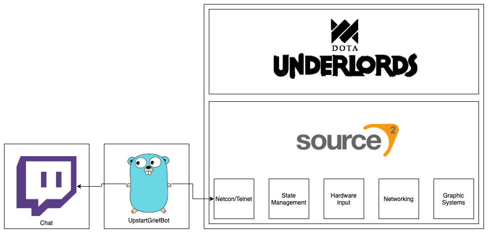
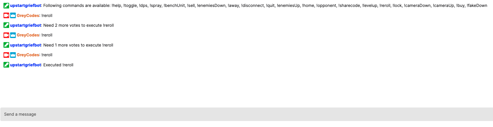
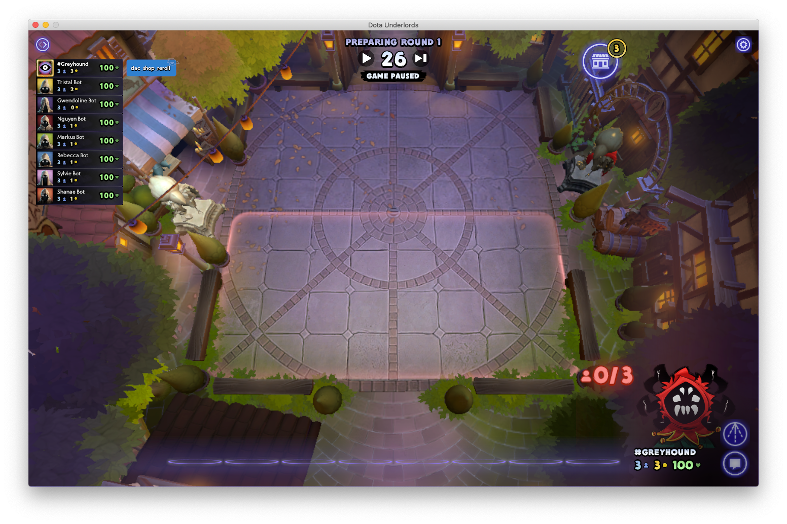

# Upstart Grief Bot

Upstart Grief Bot is a community made bot, that integrates into Twitch chat and Dota Underlords.

## Basic Architecture



At launch, the application connects to a Twitch chat and starts listening for incoming chat messages.

At the same time, the application connects [Source 2's netcon component](https://developer.valvesoftware.com/wiki/Command_Line_Options#Linux_command_options_in_Left_4_Dead_.282.29), that existed since Left 4 Dead and Left 4 Dead 2, and initiates a Telnet connection.



Once a command on twitch has been invoked often enough / above a specified threshold, a Source 2 console command is programmatically triggered and a message will show in-game.



By using a couple of internal, debug commands, even the executed command is printed on the screen.

Currently supported commands are:

- !toggle
- !dps
- !spray
- !benchUnit
- !sell
- !enemiesDown
- !away
- !disconnect
- !quit
- !enemiesUp
- !home
- !opponent
- !levelup
- !reroll
- !lock
- !cameraDown
- !cameraUp
- !buy \<slot number>
- !fakeDown

_Disclaimer: All of these commands might disappear in a future Underlords update._

## Setup

### Environment Variables

Duplicate the `.env.example` file and rename the duplicate to `.env`.

Then fill in the required values in the `.env` file.

### Steam

#### Unix

Head over to Underlords on Steam and set the following [game launch options](https://support.steampowered.com/kb_article.php?ref=1040-JWMT-2947): `-netconport 27015 +developer 1`

#### Windows

On Windows please set the following launch options `-netconport 2121 +developer 1` and add this line to the .env file:

```env
TELNET_ADDRESS=127.0.0.1:2121
```

After successfully setting the launch options, start Underlords before proceeding with one of the two following steps:

### Docker (recommended)

Prior to using the bot inside of a container install [docker](https://www.docker.com/) (or an alternative container runtime) and [docker-compose](https://docs.docker.com/compose/install/).

In order to start the bot, run: `docker-compose up`.

In order to stop it, either ctrl+c out of the previous terminal session or run `docker-compose down`.

### Local Environment

As this project is written in Go, a local installation of the Go compiler is required in order to build the source.
The Go compiler can be found at: [https://golang.org/](https://golang.org/).

Furthermore it's recommended to install `make`. (part of `build-essential` for apt-get users and part of the Xcode developer tools for macos users.)

- Building from source: `make`

  The above command will then compile the source and output the binary in `./bin/UpstartGriefBot`.

  This binary can be immediately invoked and will try connecting to a running Underlords instance. If a connection is not possible, it will fail on startup.

- Run from source: `make run`

  This should start the bot immediately.

## Other applicable use

Generally speaking, this bot can be adapted for most Valve games to receive a live stream of the Source 2 console and in response run console commands.
This might have future uses for e.g. automated camera movement in Dota 2 (in conjunction with Dota's game state integration and additional console debug prints of Source 2)

## Disclaimer

This project is not affiliated with Valve or Steam.

Valve, the Valve logo, Steam, the Steam logo, Source, the Source logo, Dota, the Dota 2 logo, Defense of the Ancients, Dota Underlords and the Dota Underlords logo are trademarks and/or registered trademarks of Valve Corporation.

TWITCH, the TWITCH Logo, the Glitch Logo, and/or TWITCHTV are trademarks of Twitch Interactive, Inc. or its affiliates.
